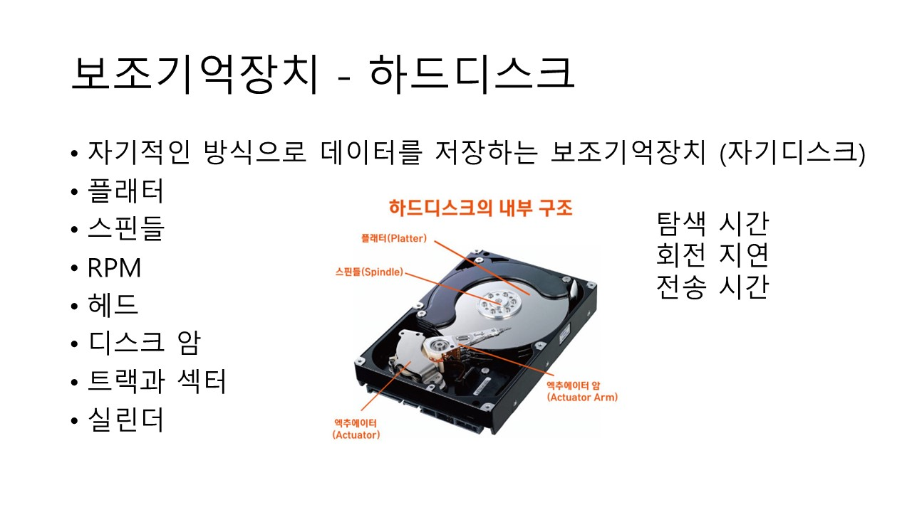

# 보조기억장치와 입출력장치

## 보조기억장치 - 하드디스크

자기적인 방식으로 데이터를 저장하는 보조기억장치 (자기디스크)

## 보조기억장치 - 플래시메모리

- NAND 플래시 메모리 NOR 플래시 메모리

- 셀 : SLC, MLC, TLC

- SLC : 한 셀로 두 개의 정보 표현 가능. 셀 당 1 bit

- 수명 길지만 용량 대비 가격이 높다.

- MLC : 한 셀로 4 개의 정보 표현 가능. 셀 당 2 bit

- 속도와 수명은 떨어지지만 대용화에 유리.

- TLC : 한 셀로 8 개의 정보 표현 가능. 셀 당 3 bit

- MLC 보다도 수명과 속도가 떨어지지만 용량 대비 가격 저렴.

  

- 페이지 -> 블록 -> 플레인 -> 다이

- Free 상태

- Valid 상태

- Invalid 상태 : 쓰레기 값은 블록 단위 삭제이기에 용량 낭비.

- 가비지 컬렉션 : 유효한 페이지들만 새로운 블록으로 복사한 뒤 기존의 블록을 삭제.

## 보조기억장치 - RAID

RAID : 하드 디스크와 SSD를 사용한 기술로 데이터의 안전성 혹은 높은 성능을 위해 여러 개의 물리적 보조 기억 장치를 마치 하나의 논리적 보조기억장치처럼 사용하는 기술 의미.

- RAID 0 : 여러 개의 보조기억장치에 데이터 단순히 너눠 구성
  스트라입, 스트라이핑
  속도 빠르지만 저장된 정보가 안전하지 않다.

- RAID 1 : 복사본 만드는 방식. 미러링
  복구가 간단하지만 사용 가능 용량이 적어지는 단점

  
- RAID 4 : 패리티 비트. 완전한 복사본 대신 검출/복구 가능한 정보 저장 장치. 적은 하드 디스크로도 데이터 안전 보관. 병목 현상.

- RAID 5 : 병목 현상 해소를 위해 패리티 정보 분산.

- RAID 6 : 오류 검출 수단 2개의 패리티 사용. 쓰기 속도 느리므로 더욱 안전하게 보관하고 싶을 때 사용

## 입출력 장치 – 장치 컨트롤러와 장치 드라이버

**장치 컨트롤러 역할**

- CPU와 입출력 장치 간의 통신 중개

- 오류 검출

- 데이터 버퍼링

**장치 컨트롤러 내부 구조**

- 데이터 레지스터

- 상태 레지스터

- 제어 레지스터

## 다양한 입출력 방법

프로그램 입출력 : 프로그램 속 명령어로 제어

메모리 맵 입출력 : 메모리 접근 주소 공간과 입출력장치 접근 주소 공간을 하나의 주소 공간으로 간주. 1024개 메모리 주소 중 512개는 메모리 주소를, 512개는 장치 컨트롤러의 레지스터를 표현. 미모리와 입출력 장치가 같은 명령어 사용.

고립형 입출력 : 메모리를 위한 주소 공간과 입출력 장치를 위한 주소 공간 분리. 메모리 주소 공간이 축소 되지 않고 입출력 전용 명령어 사용.

인터럽트 기반 입출력 : 인터럽트를 기반으로 입출력. 장치 컨트롤러가 입출력 작업이 끝나면 CPU에 인터럽트 요청 신호를 보내는 방식.
여러 개의 인터럽트 발생 시 우선순위 반영해 다중 인터럽트 처리.
프로그래머블 인터럽트 컨트롤러 ( PIC) NMI

DMA 입출력 : 위 두 개는 CPU 무조건 거쳐 CPU 연산 시간을 뺏어 CPU 거치지 않고 상호작용 할 수 있는 입출력 방식. 시스템 버스에 연결된 DMA 컨트롤러를 이용.

